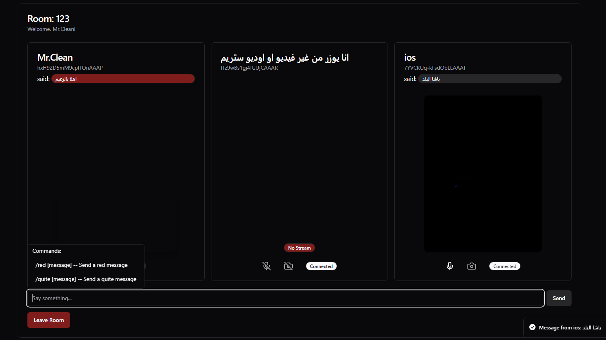

<h1 style="display: flex; align-items: center; justify-content: center;">
  <span>Meets Clone</span> 
</h1>

## Description

A video/audio/text chat application that allows users to create rooms and join rooms to chat with other users.
_educational purposes only, not ready for production_.

using WebRTC for video and audio chat, and Socket.io for text chat and Signaling.

## Demo

[Meets Clone Demo
](https://meets-clone.onrender.com/)

<center></img></center>

## Features

-  Create rooms
-  Join rooms
-  Chat with other users
-  Video chat
-  Audio chat
-  Text chat
-  Share screen (coming soon)
-  Target user messages (coming soon)

## Technologies

### Frontend

-  TypeScript
-  React
-  Shadcn/UI
-  TailwindCSS
-  WebRTC
-  Socket.io
-  SimplePeer
-  Framer Motion

### Backend

-  TypeScript
-  Node.js
-  Express
-  Socket.io

## Installation

1. Clone the repository
2. Install dependencies for the frontend and backend

```bash
cd client && npm install
cd server && npm install
```

3. Development

```bash
npm run dev
```

4. Production

```bash
npm run build && npm start
```
